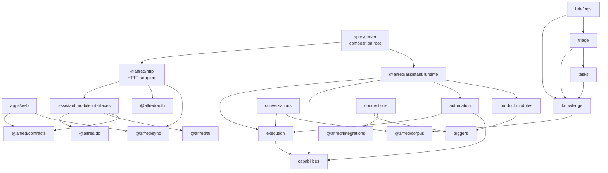

# Agent-friendly module structure

> **Status:** active migration plan. Phase 0 is complete and Phase 1 is in
> progress.
>
> **Basis:** the repository state on 2026-08-01. Git history has been rewritten
> and is not evidence for how the repository evolved.

## Outcome

Make Alfred easy to navigate and change through a small set of deep modules.
Each module owns a domain decision, exposes one small interface, hides its
implementation, and can be tested through the same interface that callers use.

The final structure must preserve these product properties:

- one Node process and one web app;
- durable, resumable agent execution;
- exact capability authorization and approval gates;
- provider integrations with safe credential handling;
- Postgres as the source of truth and Replicache as the browser sync protocol;
- existing HTTP, queue, persisted-run, and synced-data compatibility during the
  migration.

This is a dependency and ownership migration. It is not a microservice split, a
framework rewrite, or a request to make every file small.

## Current evidence

The present server-side implementation lives mostly in `@alfred/api`:

- `packages/api/src/modules` has 28 top-level directories and about 68,600 lines
  of TypeScript.
- A static scan finds one strongly connected cluster containing 17 modules:
  `agent`, `approvals`, `briefing`, `chat`, `chat-memory`, `cold-start`,
  `dispatch`, `drift-audit`, `features`, `integrations`, `mcp`, `memory`,
  `timezone`, `todos`, `tools`, `triage`, and `workflows`.
- `packages/api/src/backend.ts` is a 319-line export facade. It exposes domain
  operations, helpers, queue handles, workflow internals, and test controls
  through one entry point.
- HTTP route construction, domain behavior, queue workers, runtime lifecycle,
  external integration coordination, and sync projection all share the same
  package.
- `apps/server/src/builtins/workflows` contains product workflow state machines,
  not only composition adapters.
- `apps/server/src/runtime.ts` imports more than 40 lifecycle operations because
  each queue and worker exposes its mechanics to the composition root.
- `packages/api/src/modules/integrations/queue.ts` coordinates Gmail ingestion,
  embedding, triage, user-model projection, chat attachment enrichment,
  workflow events, storage cleanup, and UI update events.
- The web feature directories are much healthier. There are 15 current imports
  between route-private feature directories: ten preview/styleguide adapters
  and five product-feature imports. The web plan should preserve the general
  locality and remove the five product-feature doors in Phase 7.

These figures are navigation signals. A large file or an import edge is not a
defect by itself. The load-bearing problem is that a caller can reach many
implementation details and several domain decisions have no single owner.

## Design rules

1. **One module owns one coherent set of decisions.** Code that changes for the
   same domain reason belongs together, even when it uses several files,
   tables, queues, or external providers.
2. **One interface per module.** Cross-module callers import only the module's
   `index.ts`. Internal files are not supported entry points.
3. **One-way dependencies.** A module graph must be acyclic. A cycle means the
   seam is wrong, a protocol has no owner, or composition behavior has leaked
   into both sides.
4. **Transport stays outside domain modules.** Elysia routes, SSE framing,
   Replicache push/pull, BullMQ job envelopes, and provider wire shapes adapt to
   module interfaces. They do not define domain behavior.
5. **Composition is allowed to know many modules.** HTTP adapters, sync
   adapters, tool registration, and the process runtime are top-level wiring.
   Product modules must not import those composition layers back.
6. **Use direct calls for synchronous work.** Use durable events only when work
   is asynchronous or several independent consumers react to the same fact.
   Do not use an event bus to hide an ordinary function call.
7. **Inject only real variation.** Use a port for an external provider, clock,
   or production/test adapter. Do not add repository interfaces for every table
   or one-implementation abstractions for possible future use.
8. **The interface is the main test surface.** Contract tests assert observable
   results, state transitions, failures, retries, and forbidden effects. Small
   internal seams can have focused tests when necessary.
9. **Database table ownership follows modules.** The schema remains in
   `@alfred/db`, but only the owning module writes a domain table. A
   cross-domain transaction is owned by an explicit coordinator.
10. **Compatibility paths get a deletion date.** A temporary old and new door
    is permitted only when the opening slice names the closing slice and marks
    the old door as transitional.

## Target package structure

```text
apps/
  server/                    process entrypoint and operational scripts
  web/                       browser composition and route-private features

packages/
  http/                      Elysia, SSE, webhook, and Replicache HTTP adapters
  assistant/                 Alfred product modules and runtime composition
  contracts/                 browser-safe cross-boundary schemas and types
  sync/                      browser-safe Replicache protocol
  db/                        schema, migrations, connection, DB-level primitives
  ai/                        model construction, provider policy, metering
  integrations/              provider clients and provider wire translation
  corpus/                    document indexing and semantic retrieval
  auth/                      Better Auth integration and auth credential adapter
  mailer/                    email rendering adapter
  artifacts-design/          shared artifact rendering and validation rules
  env/                       validated deploy configuration
  config/                    shared build configuration
```

### Package decisions

- Add `@alfred/assistant`. It owns Alfred's product behavior that currently sits
  inside `@alfred/api`.
- Replace the mixed `@alfred/api` package with `@alfred/http` after product
  behavior has moved. Its public interface is the Elysia `app`, `App` type, and
  transport-specific test helpers.
- Rename `@alfred/ingestion` to `@alfred/corpus` after its interface is deepened.
  It already owns both document indexing and search, so “ingestion” describes
  only half of its work.
- Keep `@alfred/integrations`, but move credential persistence, application
  queues, and cross-domain fan-out into `@alfred/assistant/connections`.
  Provider clients should accept validated configuration and credential
  resolvers instead of finding application state themselves.
- Do not create one package per domain module. Package-level isolation is useful
  for runtime and deployment constraints. Internal module checks are a cheaper
  and clearer tool for the assistant product model.
- Do not add a root export from `@alfred/assistant`. Use explicit subpath exports
  such as `@alfred/assistant/execution` and `@alfred/assistant/knowledge`.

## Target assistant modules

Each directory below has this shape:

```text
<module>/
  index.ts                   the only cross-module interface
  internal/                  implementation; not imported by other modules
  adapters/                  concrete adapters owned by this module, when needed
```

A worker-owning module may also expose lifecycle through its main interface.
The process still sees only `createAssistantRuntime().start()` and `.stop()`.

| Module | Owns | Intended interface | Current main homes |
| --- | --- | --- | --- |
| `execution` | Durable runs, leases, checkpoints, attempts, cancellation, resume, child joins, recipe registration | `registerRecipe`, `startRun`, `signalRun`, `cancelRun`, `getRun`; queueing is internal | `agent`, `scratchpad`, agent worker/join code |
| `capabilities` | Capability catalog, model-visible surface, schema validation, authorization, risk, action staging, tool-call approval, execution, result routing | `registerCapabilities`, `resolveSurface`, `executeCalls`, `resolveApproval`; registry and queues stay private | `tools`, `dispatch`, `approvals`, `action-policies`, MCP execution ledger |
| `automation` | User-authored workflow definitions, revisions, readiness, triggers, schedules, occurrence claims | `createDraft`, `revise`, `activate`, `acceptEvent`, `dispatchDue` | `workflows`; user-authored recipe compilation |
| `triggers` | Durable domain-event publication and trigger-consumer delivery | `publishDomainEvent`, runtime consumer registration; no imports of consumers | `src/events`, `workflows/events`; not HTTP SSE framing |
| `connections` | Connected-account lifecycle, OAuth state, credential binding, provider availability, watches, webhooks, provider ingestion coordination | `connect`, `disconnect`, `availabilityFor`, `forUser`, `acceptWebhook` | legacy API `integrations`, provider-binding parts of `mcp`, ingestion queue |
| `corpus` | Normalized documents, chunks, embedding state, indexing retries, semantic search | `indexDocument`, `retryPending`, `search` | `@alfred/ingestion`, document embedding work in integration jobs |
| `knowledge` | Observation log, projections, facts, entities, significance, standing instructions, recall, correction | `observe`, `recall`, `contextFor`, `applyCorrection`, projection lifecycle | `memory`, `user-model`, `chat-memory` extraction behavior |
| `settings` | User preferences, feature flags, account persona, briefing schedule, canonical timezone preference | `get`, `set`, `resolveTimezone`, `resolveFlags` | memory preferences, `features`, parts of briefing preferences and onboarding |
| `conversations` | Threads, messages, turn admission, attachments, stop behavior, context assembly, summaries and compaction | `startTurn`, `stopTurn`, `getThreadContext`; chat recipe is registered with execution | `chat`, agent chat workflow, agent compaction, chat-memory scheduling |
| `triage` | Email attention classification, sender context, observations, label reconciliation, triage decision persistence | `triageMessage`, `classify`, `reconcileThread`, attention queries | `triage`; triage parts of ingestion jobs |
| `briefings` | Gather, suppression, compose, persistence, delivery decision, reference resolution | `prepareBriefing`, `getBriefing`, `listBriefings`; recipe stays internal | `briefing`, server daily/legacy briefing workflows |
| `tasks` | Todo suggestion, source provenance, lifecycle and resolution | `suggest`, `create`, `complete`, `dismiss`, `resolveSources` | `todos`, related Replicache mutators |
| `artifacts` | Artifact reads, writes, content hashing, external-file lifecycle | `create`, `append`, `edit`, `read`, `attachExternalFile` | `artifacts` |
| `skills` | Skill revisions, mentions, learning, documentation and run status | `learn`, `revise`, `resolveMentions`, `getSkill` | `skills`, `skill-documentation`, server skill workflows |
| `delivery` | Notification idempotency and channel selection | `send` | `notifications`; mailer remains a rendering adapter |
| `time` | Pure IANA-zone and local-day calculations | `inZone`, day-key operations | `timezone/local-time`; no preference reads |

### Modules that disappear

- `me` becomes HTTP read-model adapters that call owning modules.
- `onboarding` becomes an HTTP adapter over `settings`, `connections`, and the
  appropriate knowledge bootstrap operation.
- `features` moves into `settings`.
- `drift-audit` moves into the owning knowledge/operations implementation; its
  notification is sent through `delivery`.
- `chat-memory` splits: conversation-idle scheduling belongs to
  `conversations`; observation extraction belongs to `knowledge`.
- `approvals` splits: generic step-level human-in-the-loop wake conditions
  belong to `execution`; tool-call action staging and decisions belong to
  `capabilities`; workflow activation validation belongs to `automation`.
- `mcp` splits: connection/protocol/session behavior belongs to `connections`;
  risk, tool-call approval, durable invocation, and tool-result correlation
  belong to `capabilities`.

## Required dependency direction



The diagram omits some ordinary leaf dependencies. These rules are
load-bearing:

- `execution` does not import conversations, automation, triage, briefing,
  skills, or other product recipes. Those modules register recipes with it.
- `execution` owns generic step-level human-in-the-loop state and wake
  conditions. It does not own tool-call action staging or workflow activation
  policy.
- `capabilities` does not import execution or feature modules. A capability
  handler receives a bounded execution context. Domain capability definitions
  are registered by top-level composition.
- `connections` publishes domain events but does not import automation, triage,
  knowledge, or conversations to fan work out.
- `knowledge` does not import triage or tasks. Email-specific parsing happens in
  an adapter before `knowledge.observe`.
- `time` is pure. `settings.resolveTimezone` reads the user preference and
  returns the branded zone used to bind `time.inZone`.
- `@alfred/http` may depend on many assistant interfaces. Assistant modules do
  not import transport.

## Key interfaces

These are design sketches, not final TypeScript declarations. Each implementation
slice must design the interface twice and choose the smaller caller contract.

### Execution

```ts
interface Execution {
  registerRecipe<S>(recipe: Recipe<S>): void;
  startRun(command: StartRun): Promise<StartRunResult>;
  signalRun(command: SignalRun): Promise<SignalRunResult>;
  cancelRun(command: CancelRun): Promise<CancelRunResult>;
  getRun(query: GetRun): Promise<RunView | null>;
}
```

`startRun` owns persistence plus delivery to the worker. Ordinary callers no
longer call `createRun` and `enqueueRun` separately. The few occurrence-claim
paths that need a larger transaction use one explicit transactional operation;
they do not receive the queue handle.

### Capabilities

```ts
interface Capabilities {
  register(definitions: readonly CapabilityDefinition[]): void;
  resolveSurface(context: SurfaceContext): Promise<CapabilitySurface>;
  execute(context: ExecutionContext, calls: readonly CapabilityCall[]): Promise<CallRound>;
  resolveApproval(command: ResolveApproval): Promise<ApprovalResolution>;
}
```

The implementation hides tool-name normalization, registry mechanics,
availability, validation, risk floors, action policy, staging, approval jobs,
MCP broker rules, and result routing. System capabilities that spawn or join a
run receive bounded callbacks in `ExecutionContext`; they do not import
execution internals.

### Triggers

Here, `triggers` means publication of domain occurrences and delivery to the
modules that react to them. It does not own workflow trigger definitions,
filters, schedules, or occurrence claims; those remain in `automation`.

```ts
interface Triggers {
  publishDomainEvent(event: DomainEvent, options: PublishOptions): Promise<PublishedEvent>;
}
```

Trigger consumers are registered in runtime composition. A connection event can
wake automation, triage, or knowledge without the connection module importing
any of them. Durable occurrence claims remain owned by automation/execution,
not by the generic event transport.

### Knowledge

```ts
interface Knowledge {
  observe(input: ObservationInput): Promise<ObservationResult>;
  recall(query: RecallQuery): Promise<RecallResult>;
  contextFor(query: UserContextQuery): Promise<UserContext>;
  applyCorrection(command: CorrectionCommand): Promise<CorrectionResult>;
}
```

Observation storage, projection folds, fact supersession, entity identity,
significance, and standing-instruction precedence are internal. Triage supplies
a normalized sender observation; knowledge does not call triage parsers.

### Connections

Preserve the strong user-bound integration root already emerging in the code:

```ts
interface Connections {
  availabilityFor(userId: string): Promise<ConnectionAvailability>;
  forUser(userId: string): UserConnections;
  acceptWebhook(input: WebhookInput): Promise<WebhookResult>;
}
```

`UserConnections` exposes provider-normalized operations. It does not expose
tokens, credential rows, retry primitives, or provider response bodies.

## Composition adapters

Some code must know both a domain module and the capability, HTTP, or sync
protocol. Put that code in an explicit top-level adapter instead of forcing the
two modules to import each other:

```text
packages/assistant/src/composition/
  recipes/                    register product recipes with execution
  capabilities/               register domain capability definitions
  trigger-consumers/           connect domain events to trigger consumers

packages/http/src/
  <domain>.ts                  Elysia request/response adapters
  sync/read/<domain>.ts        Replicache read contributors
  sync/write/<domain>.ts       server mutator adapters
  realtime/                    SSE and Replicache poke delivery
```

The composition directories contain wiring only. They do not become a second
home for domain decisions.

## Database and contract ownership

### Database

- Keep one `@alfred/db` package and one migration ledger.
- Add a table-ownership map to the architecture check. Start by enforcing
  writes; read-only transport projections can use documented exceptions.
- Do not create a `FooRepository` for every table. Use real Postgres tests for
  database semantics. Add a port only when a second adapter exists or the seam
  isolates a true external dependency.
- Cross-domain writes use an owning coordinator and accept the existing
  `DbTransaction` when atomicity crosses modules.

### Contracts

- Keep only browser/server, persisted-protocol, or provider-independent wire
  contracts in `@alfred/contracts` and `@alfred/sync`.
- Keep server-only internal types in the owning assistant module.
- Replace wildcard package exports with an explicit list of supported
  subpaths. Keep the root `@alfred/contracts` barrel temporarily for source
  compatibility, then reduce it after consumers use domain subpaths.
- Generate or derive contract shapes from their source of truth. Do not copy a
  database row into a transport type unless the transport deliberately reshapes
  it.

## Web structure

The current route-private feature layout already provides good locality. Keep
it and make only targeted changes:

```text
apps/web/src/
  routes/
    <route>.tsx                thin route declaration
    -<feature>/                private feature implementation
  lib/
    api/                       Eden client and error mapping
    auth/
    events/
    sync/
    storage/
    shell/
  components/
    ui/                        design primitives
```

- Keep feature-specific components inside their `routes/-<feature>` owner.
- Move landing, onboarding, approval, and other feature-specific shared
  components only when their real consumers show one owner. Do not move files
  for visual symmetry.
- Keep cross-feature imports at zero except explicit preview/styleguide
  adapters. Enforce this with the architecture check.
- Do not split large React files only because they are large. Split when a
  separate state machine, policy, or reusable interface appears.

## Runtime and verification

### Runtime interface

Replace the list of worker lifecycle exports with:

```ts
interface AssistantRuntime {
  start(): Promise<void>;
  stop(): Promise<void>;
}

function createAssistantRuntime(config: RuntimeConfig): AssistantRuntime;
```

The runtime implementation owns startup order, shutdown order, registration,
recovery sweeps, and resource closure. Domain modules can still expose focused
test harnesses without exposing production queue handles to ordinary callers.

### Architecture check

Add `scripts/check-module-architecture.mjs`. It must:

1. parse package and assistant-module imports;
2. emit a stable dependency graph for diagnostics;
3. reject new package or assistant-module cycles;
4. reject cross-module imports that bypass `index.ts`;
5. reject assistant imports from `@alfred/http`, legacy `@alfred/api`, or
   `apps/server`;
6. reject production imports from preview/debug web features;
7. support narrow, reasoned legacy exceptions with an owner and removal phase;
8. self-test its parser against fixtures before reporting a clean result.

Commit the current graph as a baseline only for regression control. The target
graph in this plan is the final acceptance criterion; the baseline is not an
approved architecture.

### Verification commands

Add non-mutating root commands:

```text
pnpm verify:fast     architecture + boundaries + lint + format check + types
pnpm verify          verify:fast + deterministic package tests
pnpm verify:db       migrations + DB/Redis-backed tests
```

`pnpm check` must either become non-mutating or be renamed to state clearly that
it formats files. An agent must not need to read CI YAML to learn the complete
local feedback loop.

## Migration sequence

Every slice must move behavior behind an interface, migrate its callers, add or
retarget contract tests, and remove the superseded door. Do not land file-only
reorganizations.

### Phase 0 — Record and enforce the map

**Status:** Complete (2026-08-02). The checker, regression baseline,
non-mutating verification commands, and ADR-0089 are in the repository.

1. Add `check-module-architecture.mjs` with parser self-tests.
2. Record the present package graph, assistant module graph, SCCs, and supported
   legacy exceptions.
3. Add `verify:fast`, `verify`, and `verify:db`.
4. Add an ADR for the package split and dependency direction in this plan.

Done when the repository rejects new cycles and unsupported internal imports,
and a developer can run one non-mutating verification command.

### Phase 1 — Give events one owner

**Status:** In progress (2026-08-02). The first slice adds the in-place
`triggers` interface, routes Gmail ingestion publication through it, and wires
the workflow trigger consumer in runtime composition. Google OAuth draft
recovery now uses an integrations-owned callback interface with a workflow
adapter in runtime composition, so the broader `integrations -> workflows`
module edge is gone. Connection imports of triage, knowledge, and chat consumers
still remain. The current sole consumer attempts durable occurrence claims
before publication returns, but keeps per-workflow failure details inside
automation. Durable delivery to several independent consumers remains later
work in this phase.

1. Create the in-place `triggers` interface under `packages/api`.
2. Move durable publication out of `workflows/events`.
3. Make connection ingestion publish events without importing workflows,
   triage, knowledge, or chat.
4. Register consumers in composition.
5. Keep SSE replay and Replicache pokes in transport-specific adapters.

Done when `integrations -> workflows` is gone, event occurrence tests remain
green, and duplicate/retry behavior is unchanged.

### Phase 2 — Deepen the capability system

1. Define the `capabilities` interface in place.
2. Move catalog, discovery, active surface, dispatch, action policy, action
   staging, tool-call approvals, and MCP invocation enforcement behind it.
3. Move domain capability registration to composition adapters.
4. Replace system-tool imports of execution and automation internals with
   bounded handler context callbacks or domain interfaces.
5. Retarget existing tools/dispatch/approval tests at the capability interface;
   keep focused internal tests only for complex pure transitions.

Done when `agent <-> tools`, `agent <-> dispatch`, `dispatch <-> tools`, and
`tools <-> workflows` are no longer cycles, and all execution hazards remain
represented in types or runtime validation.

### Phase 3 — Isolate durable execution

1. Reduce `agent` to the generic execution state machine.
2. Move chat recipe, chat context assembly, summaries, and compaction to
   `conversations`.
3. Move product recipes from `apps/server/src/builtins/workflows` into their
   owning modules. Keep the app registry as a generated or explicit list of
   recipe exports.
4. Replace `createRun` plus `enqueueRun` call pairs with `startRun`.
5. Keep legacy persisted workflow slugs registered until no resumable row needs
   them.

Done when execution imports no product module and a generic execution contract
test covers start, retry, signal, cancellation, resume, and terminal closure.

### Phase 4 — Consolidate knowledge and settings

1. Move preferences, feature flags, and timezone preference resolution into
   `settings`; keep time calculation pure.
2. Put observations, projections, facts, entities, significance, standing
   instructions, and recall behind `knowledge`.
3. Move email sender parsing and sent-mail interpretation out of knowledge.
   Triage and connection adapters pass normalized observations in.
4. Remove knowledge imports of triage and tasks.
5. Deepen `@alfred/ingestion` to the corpus interface, then rename the package.

Done when `memory <-> triage`, `memory <-> todos`, and `timezone -> memory` are
gone and knowledge contract tests survive internal projection refactors.

### Phase 5 — Separate connections from provider adapters

1. Move OAuth routes, application credential lifecycle, availability, webhook
   coordination, watches, ingestion jobs, and MCP connection state behind
   `connections`.
2. Make `@alfred/integrations` provider-focused: request/response validation,
   provider pagination, OAuth exchange primitives, webhook verification, and
   normalized clients.
3. Move Gmail post-insert fan-out to event consumers owned by triage, knowledge,
   corpus, and conversations.
4. Preserve the user-bound integration root and credential-vault guarantees.

Done when the provider package does not import `@alfred/ingestion`, application
queues, or unrelated domain modules, and the connection module does not import
event consumers.

### Phase 6 — Extract assistant behavior and HTTP transport

1. Create `@alfred/assistant` with explicit subpath exports.
2. Move the now-acyclic modules from `@alfred/api` without changing their
   interfaces.
3. Create `@alfred/http` and move Elysia routes into it.
4. Split Replicache pull/push into domain composition adapters under
   `packages/http/src/sync`.
5. Replace `@alfred/api/backend` with explicit
   `@alfred/assistant/<module>` imports in operational scripts.
6. Switch the web Eden type import from `@alfred/api` to `@alfred/http`.
7. Delete the legacy `@alfred/api` package after its last transitional export
   and caller are gone.

Done when `@alfred/http` contains HTTP adapters only, `@alfred/assistant` never
imports transport, the legacy `@alfred/api` package is gone, and `apps/web`
imports only the `App` type from `@alfred/http`.

### Phase 7 — Close public surfaces and documentation

1. Replace wildcard package exports with explicit entry points.
2. Enforce the table-ownership write map.
3. Apply the targeted web cleanup and cross-feature check.
4. Update the architecture reference, affected ADR links, operation scripts,
   codebase index, and the roughly 200 documentation references to old API
   module paths.
5. Remove all architecture-check exceptions opened by this migration.

Done when the target graph is acyclic, every module has one supported interface,
no compatibility door remains, and repository documentation names only current
paths.

## Slice acceptance template

Each implementation issue must include:

```md
Module and owned decision:
Old doors removed:
New interface:
Dependency edges removed and added:
Required caller knowledge before and after:
Contract tests:
Persistence/protocol compatibility:
Checks run:
Documentation updated:
```

A slice is not complete if it adds the new interface but leaves ordinary
callers on the old path.

## Rejected structures

### Keep everything in `@alfred/api`

This avoids file movement but keeps transport and product behavior in one
package. The current `backend.ts` facade proves that a package name alone does
not create a useful interface.

### One package per domain

This gives strong import enforcement but creates many manifests, build nodes,
and cross-package types without a deployment need. A checked internal module
graph gives the same ownership signal with less caller knowledge.

### Horizontal `services`, `repositories`, and `utils` layers

These group code by technical role and spread one domain change across several
directories. Persistence helpers and provider adapters should remain internal to
the module whose decisions they implement.

### Ports for every dependency

Most domain persistence has one Postgres implementation and is already tested
against Postgres. An interface with one adapter adds indirection without a real
seam. Use ports for true external systems, deterministic clocks, and production
plus test adapters.

### Immediate package extraction

The current 17-module SCC would force `@alfred/assistant` to import old API
internals or require a large all-at-once move. Break cycles behind interfaces in
place first; package extraction then becomes mechanical and reviewable.

## First implementation issue

Implement Phase 0 only:

1. architecture graph and self-tested checker;
2. committed regression baseline with reasoned exceptions;
3. non-mutating verification commands;
4. ADR that records the target package split and dependency direction.

Do not move production modules in this issue. Its purpose is to make every later
structural slice measurable and safe.
