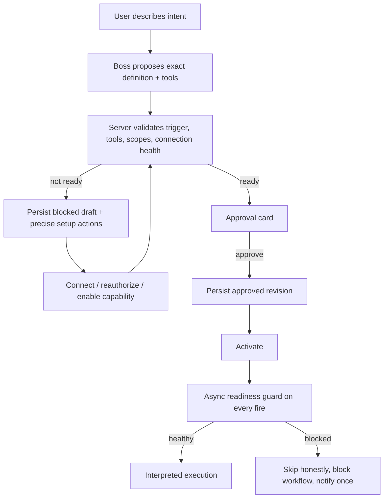

# Workflows v1: research synthesis and decision map

Status: researched 2026-07-22  
Scope: pressure-test [`workflows-v1.md`](../plans/workflows-v1.md) across product
authoring, capability readiness, runtime semantics, integration event lifecycles,
sync/materialization, and the later self-syncing/compiled path.

## Executive conclusion

The plan's core cut is right: Alfred can ship a useful interpreted, brief-only
workflow authoring path without waiting for code mode, a DAG interpreter, a
generic sync engine, or a vector index. The repo already has the durable run
loop, cron/event dispatch, integration gating, approval staging, and a shared
brief executor.

The plan is not ready to build unchanged, however. It currently makes the
author-time invariant too coarse and the missing-integration UX too lossy:

1. **Gate exact capabilities, not integration slugs.** A healthy `gmail`
   connection can support reads while lacking the scope for a specific write.
   `allowed_integrations` is a security ceiling, not proof that a workflow's
   intended actions are executable.
2. **Preserve an unsatisfied proposal as a blocked draft.** "Persist nothing"
   is safe but makes an OAuth detour destroy the user's work. The stronger
   product posture is: never activate an unsatisfied workflow, while keeping
   the exact inferred definition and a resumable connect/re-authorize path.
3. **Revalidate every definition revision, not only creation.** The existing
   editor can change the brief, trigger, and integration ceiling on an active
   workflow. If edits bypass capability resolution, the author-time guarantee
   disappears immediately after first save.
4. **Treat runtime health, outcome reporting, and definition revisioning as
   part of the v1 spine.** They are what make an unattended feature trustworthy,
   not follow-up polish.

The later self-syncing path is real but is a different product/runtime tier. It
is not simply "turn on ADR-0087 code mode": ADR-0087 deliberately provides
thread-scoped, TTL-bound data handles and a network-less transient compute
isolate, while a compiled workflow needs persistent versioned code, event
ingress, subscription renewal, signature verification, durable dedup/state,
controlled egress, migrations, and autonomous recovery.

The supporting primary-source notes are:

- [product and authoring UX](./workflows-v1-product-authoring-ux.md);
- [runtime and execution semantics](./workflows-v1-runtime-semantics.md); and
- [integration and event lifecycle](./workflows-v1-integration-event-lifecycle.md).

## What Alfred already proves locally

### The thin interpreted slice is feasible now

- User-authored rows already model `trigger + brief + optional steps`, and
  registry misses for non-builtin rows resolve to the shared brief executor
  ([workflow schema](../../packages/db/src/schema/workflows.ts),
  [run resolution](../../packages/api/src/modules/agent/service.ts)).
- Cron dispatch advances `next_run_at` with a compare-and-swap and event
  dispatch creates runs through the same `createRun` seam
  ([cron tick](../../packages/api/src/modules/workflows/tick.ts),
  [event dispatch](../../packages/api/src/modules/workflows/events.ts)).
- The brief runner already snapshots `allowedIntegrations`, seeds exact tool
  names, and rechecks tool availability at dispatch
  ([brief executor](../../packages/api/src/modules/agent/workflows/user-authored-brief.ts),
  [availability](../../packages/api/src/modules/integrations/availability.ts)).
- A `high`-risk `system.author_workflow` would in fact always stage for
  approval: `system.*` forces policy mode to `autonomy`, but the independent
  `high`-risk floor still requires approval
  ([dispatch gate](../../packages/api/src/modules/dispatch/index.ts)).

This supports the plan's most important sequencing claim: code mode, generated
handlers, and general indexing are not v1 prerequisites.

### The current readiness unit is too coarse

`readIntegrationAvailability` produces a useful provider/integration snapshot,
but the true execution check is `evaluateToolAvailability`, which additionally
considers exact tool scope requirements, caller context, thread requirements,
feature flags, and the workflow ceiling
([availability](../../packages/api/src/modules/integrations/availability.ts)).
The contract registry also shows why slug readiness is insufficient: one slug
contains read and write actions with different requirements, while Slack,
Linear, and iMessage currently contain no actions at all
([tool contracts](../../packages/contracts/src/tools.ts)).

Therefore `required_capabilities: ['gmail']` cannot prove that "find a message"
and "send a reply" are both ready. The authoring proposal should carry exact
required tool names (and, for dynamic MCP, connection + remote tool identity),
then resolve those through the same availability function dispatch trusts.

Recommended v1 shape:

```ts
{
  allowedIntegrations: IntegrationSlug[]; // coarse hard ceiling
  requiredCapabilities: Array<{
    tool: ToolName;
    accountRef?: string;                  // selected mailbox/workspace/install
    resourceScope?: unknown;              // repo/team/calendar boundary
  }>;
  trigger: AuthorableWorkflowTrigger;
  brief: string;
}
```

The exact capability manifest should be visible on the approval card. Runtime may
still use lazy loading, but it must not silently grow beyond the approved
execution envelope. If flexible discovery is retained, the product promise
must be weakened from "fully validated" to "best-effort readiness," and every
newly discovered write remains separately approval-gated.

### Creation-only validation does not establish a durable invariant

The existing `workflowUpdate` path can mutate `brief`, `trigger`,
`allowedIntegrations`, and `status`, including activating a row
([client contract](../../packages/sync/src/mutators/workflows.ts),
[server mutator](../../packages/api/src/modules/replicache/server-mutators/index.ts)).
It validates cron syntax and the event-source ceiling, but not connection or
exact tool readiness. Consequently a perfect create helper would be bypassed by
the first editor save.

Use one definition-revision service for chat creation, UI edits, reactivation,
and future programmatic changes. That service should:

1. validate trigger and definition shape;
2. resolve exact capability readiness;
3. create a new immutable or auditable definition revision;
4. activate only a satisfied revision;
5. copy the revision id and capability snapshot onto each run.

`agent_runs` already snapshots much of the effective definition (`brief`,
trigger, metadata/allowlist), so this is an extension of the existing replay
story rather than a new runtime.

### The authoring tool must be chat-only

`system.author_workflow` should declare `requiresThread: true` and
`callers: ['boss']`. Without that availability constraint, a background
user-authored brief can discover and invoke the authoring tool, allowing an
unattended workflow to propose or recursively create workflows. High-risk
approval limits the damage but does not make self-replication a desirable
surface.

### The proposed runtime guard needs a real async seam

`userAuthoredBriefWorkflow.initialState` is synchronous. It cannot perform the
proposed database-backed health recheck. The clean placement is an explicit
async `check-readiness` first step, before `boss-turn`. This also leaves a real
run record with a typed `blocked`/`skipped` outcome for History instead of
throwing before the system can explain itself.

The guard should not overload a user pause with an infrastructure pause. Keep
the user's desired state separate from an effective blocker, for example:

```ts
desiredStatus: 'active' | 'paused';
blocked: null | {
  code: 'connection_missing' | 'needs_reauth' | 'scope_missing' | 'tool_removed';
  capabilities: string[];
  since: string;
};
```

That makes reconnect behavior explicit: when the same approved revision becomes
healthy again, Alfred can either auto-resume the still-desired active workflow
or ask once, without confusing the event with a manual pause.

A terminal authorization/capability failure belongs on this blocking path. A
transient provider outage, timeout, or rate limit does not: defer and retry the
occurrence under a bounded policy, and only escalate after a threshold. IFTTT
and Zapier similarly distinguish disconnected/held work from individual
failures rather than disabling immediately
([product research](./workflows-v1-product-authoring-ux.md#8-runtime-connection-failure-needs-hold-recovery-and-replay-semantics)).

### Event readiness exists before and outside any run

A pre-run guard cannot detect an event subscription that has silently expired:
there is no event, therefore no run in which to perform the check. Provider
contracts make this a separate readiness axis. Gmail watches must be renewed
and recovered through `historyId`; Calendar channels expire and use sync tokens;
GitHub does not automatically redeliver failed webhooks; Slack and Linear have
finite retry/disable behavior without a general replay cursor
([integration lifecycle research](./workflows-v1-integration-event-lifecycle.md#event-lifecycle-by-provider)).

For event-authored workflows, activation therefore requires both:

```ts
capabilityReady: boolean; // account, scopes, exact tools
triggerReady: boolean; // subscription provisioned and healthy
```

`triggerReady` needs continuous renewal/delivery/cursor monitoring, not only an
author-time setup call. Surface `trigger_degraded` or `coverage_gap` when event
completeness cannot be proven; never report a confident no-op merely because no
webhook arrived.

### Event triggers need semantic honesty and a cost guard

The authorable event contract currently supports only
`gmail.message_received`, with no filter. `emitEvent` therefore creates a full
interpreted run for every matching delivery; any condition such as "when my
boss emails about launch" is evaluated after the run starts, not at event
matching time
([authorable trigger](../../packages/sync/src/mutators/workflows.ts),
[event dispatch](../../packages/api/src/modules/workflows/events.ts)).

The approval UI must say this literally. It must not render a semantic user
condition as if Gmail or the dispatcher enforces it. Before allowing event
authoring broadly, add per-workflow run/concurrency/cost telemetry and a circuit
breaker. High event volume plus low selectivity is the first strong signal that
a deterministic prefilter, object projection, or compiled handler has earned
its complexity.

### Run History is real v1 work, not a trivial query

The workflow detail History and Approvals tabs currently render preview data,
and the generic executor does not maintain the workflow row's `lastRun*`
shortcuts
([History tab](../../apps/web/src/routes/-workflows-detail/history-tab.tsx),
[Approvals tab](../../apps/web/src/routes/-workflows-detail/approvals-tab.tsx),
[workflow schema](../../packages/db/src/schema/workflows.ts)). A useful history
also needs an outcome summary that is not derivable cheaply or reliably from an
arbitrary transcript on every page view.

Define a typed terminal outcome on the run itself:

```ts
type WorkflowRunOutcome =
  | { kind: "completed"; summary: string; actions: ActionReceipt[] }
  | { kind: "no_change"; summary: string }
  | { kind: "blocked"; code: string; recovery: RecoveryAction[] }
  | { kind: "waiting_approval"; approvalIds: string[] }
  | { kind: "failed"; code: string; safeMessage: string }
  | { kind: "unknown_write_outcome"; operationId: string; safeToRetry: false };
```

Then sync a bounded, paginated run projection to the page. This is also the
right home for source/provenance gaps and "did less than requested" honesty.

### Runtime identity and cancellation need strengthening

The existing durable loop is a good substrate, but the current plan's
"runtime unchanged" claim is too strong. The runtime research found three
correctness gaps that directly affect unattended workflows
([runtime research](./workflows-v1-runtime-semantics.md#2-alfreds-current-execution-model)):

- **Occurrence identity:** cron advances its cursor before run creation, and
  event dedup only suppresses nonterminal duplicate runs. Add a durable,
  database-unique occurrence key based on workflow plus scheduled instant or
  provider delivery ID, and recover unenqueued claimed runs.
- **Effect identity:** the default step idempotency key contains `attempt`, so it
  changes on reclaim. Keep a logical `effect_key` stable across attempts and
  record provider idempotency/reconciliation evidence. A possibly delivered
  write is `unknown`, never an ordinary retryable failure.
- **Cancellation fencing:** cancellation changes run status without changing the
  attempt, while a success commit is fenced by id + attempt rather than expected
  running status. An already-running step can potentially advance a cancelled
  run. Increment a cancellation generation/fence and recheck immediately before
  dispatching eager or staged effects.

Approval also binds an exact revision and effect—not a vague future action—and
capability/safety preconditions must be revalidated after a long approval wait
([OpenAI Agents SDK HITL guidance, via runtime research](./workflows-v1-runtime-semantics.md#14-human-approval-is-durable-state-attached-to-a-specific-pending-call)).

## Product flow recommendation

The safest happy path and the best missing-integration path can share one
state machine:



Important properties:

- A missing integration blocks activation, not capture of intent.
- OAuth/re-auth returns to the exact draft instead of asking the user to repeat
  the workflow.
- The approval card shows the concrete timezone-resolved schedule and exact
  tool/capability envelope.
- Connection setup and workflow approval are separate consents.
- Editing or reactivating goes through the same validation state machine.
- Runtime loss of capability produces a typed recovery state, not a generic
  failed run or a silently degraded answer.

## Sync, indexing, and materialization

The plan is right to reject a generic vector/sync engine as a prerequisite.
Three needs should remain separate:

| Need                                                 | Correct substrate                                               | When it is earned                                             |
| ---------------------------------------------------- | --------------------------------------------------------------- | ------------------------------------------------------------- |
| Current remote truth or a one-off action             | Live integration tool/API                                       | Small result, freshness matters                               |
| Exact lifecycle, dedup, joins, missed-event recovery | Provider-specific `integration_objects` reducer/materialization | Repeated workflow needs stable exact state across events      |
| Semantic retrieval over large unstructured history   | `documents`/chunks + pgvector                                   | The workflow actually asks meaning-based historical questions |

An issue becoming "a vector in our DB" does not help decide whether it is open,
whether webhook delivery 74 was already applied, or whether a write may be
retried. Those are exact-keyed state and operation-ledger problems. Embeddings
are useful only when the workflow needs semantic recall over issue bodies,
threads, documents, or messages.

Build materialization demand-first:

1. execute live/interpreted;
2. measure repeated reads, payload size, event volume, selectivity, and stale or
   missed-event failures;
3. add the smallest provider-specific reducer/object projection that fixes the
   measured problem;
4. add embeddings only for an observed semantic-retrieval query.

There is one deliberately generic substrate worth building for events, but it
is not a generic content mirror:

- a subscription record with provider-native ids, resource selection,
  expiration, renewal, and delivery health;
- a durable event receipt keyed by provider delivery identity, written before
  acknowledgement;
- a provider-native cursor/checkpoint (`historyId`, `syncToken`, delivery audit
  watermark, or workflow-specific reconciliation checkpoint); and
- provider-specific recovery logic behind a common operational surface.

The provider facts and suggested minimal records are detailed in
[the integration lifecycle note](./workflows-v1-integration-event-lifecycle.md#minimal-primitives-alfred-actually-needs).

## Interpreted to compiled: a graduation ladder

The local `self-syncing-agent` demonstrates a valuable later architecture: an
agent authors schema, handler, signature verifier, subscription registration,
and an egress allowlist once; approved code then handles webhook deliveries
without an LLM in the steady-state ingestion path. It also demonstrates the
work that "compile it" actually entails: isolated per-sync state, versioned
code/cache identity, schema migration and rollback, webhook cleanup, secretless
credential injection, signature verification, dedup, diagnostics, and renewal
for expiring watch channels
([self-syncing-agent README](../../../../oss/self-syncing-agent/README.md),
[create contract](../../../../oss/self-syncing-agent/src/agent/tools/write/create-sync.ts),
[update contract](../../../../oss/self-syncing-agent/src/agent/tools/write/update-sync.ts)).

Use a measured ladder rather than a binary architecture choice:

1. **Interpreted brief** — scheduled/manual work and low-volume events.
2. **Deterministic prefilter/reducer** — avoid full runs for obviously
   irrelevant events; maintain exact object state when needed.
3. **Generated persistent handler** — only after the workflow definition and
   provider contract are stable and steady-state volume/cost/latency justify it.
4. **Handler-spawned agent** — deterministic ingress/materialization, with an
   agent invoked only for selected deliveries that truly require judgment.

Compilation should require evidence on all of these axes:

- event frequency and selectivity;
- interpreted LLM cost and latency;
- definition stability/revision churn;
- deterministic test fixtures and provider schema stability;
- failure impact and required delivery semantics;
- whether durable local state materially improves the workflow.

ADR-0087's isolate may eventually contribute containment primitives, but its
current network-less, credential-less, transient charter should not be silently
widened into persistent webhook programs. That deserves its own ADR and threat
model.

## Research and experiment backlog

### P0 — settle before implementation

1. **Capability manifest experiment.** Run 20–30 realistic workflow prompts
   through the boss. Compare `integrations[]` against exact `requiredTools[]`
   reviewed by a human. Measure under-naming, over-naming, and scope misses.
2. **Blocked-draft UX prototype.** Test three flows: missing connection, expired
   credential, and connected-but-missing-scope. Verify the user returns from
   setup to the exact proposal and understands whether it is active.
3. **Definition revision contract.** Decide what is immutable, what each run
   snapshots, and whether a blocked connection automatically resumes an
   unchanged approved revision.
4. **Outcome taxonomy.** Define terminal/no-op/blocked/waiting/unknown outcomes
   and design the smallest run-history projection that can render them without
   transcript archaeology.

### P1 — validate the unattended happy path

5. **Failure-injection matrix.** Revoke a credential before enqueue, between
   readiness check and tool call, and mid-run; remove a scope; disable a feature
   flag; delete a tool; delay a cron tick; duplicate an event. Confirm one
   honest, recoverable state for each.
6. **Event-volume/cost spike.** Replay a representative Gmail day into a
   semantic event workflow and measure match rate, full runs, no-ops, token
   cost, latency, and concurrency. This decides whether deterministic filters
   belong in v1.1 rather than in an abstract future.
7. **Test-run semantics.** Determine which proposed workflows can be simulated
   read-only, which need fixture payloads, and which writes can only be safely
   plan-previewed. Avoid promising a universal dry run that external APIs cannot
   actually provide.
8. **Notification/recovery UX.** Decide deduping and cadence for "workflow
   blocked" notifications, plus the reconnect-to-resume policy.
9. **Occurrence/effect crash matrix.** Crash after occurrence claim, after
   provider acceptance but before local commit, during approval resume, and
   during cancellation. Require one run per occurrence, stable effect identity,
   no post-cancel advancement, and honest `unknown` outcomes.

### P2 — establish the compilation threshold

10. **Port one proven workflow to a generated handler.** Choose a high-volume,
    stable, low-risk event flow; compare cost, latency, failure modes, operational
    burden, and revision UX against interpreted execution.
11. **Subscription lifecycle harness.** Exercise registration, signature
    failure, duplicates, out-of-order delivery, retry, renewal, missed-event
    reconciliation, pause/resume, and unregister against each provider family.
12. **Persistent-code threat model.** Specify code provenance, review diff,
    revision rollback, egress/credential boundary, resource budgets, secret
    rotation, data retention, and prompt-injection containment before reusing
    any code-mode substrate.

## Recommended changes to `workflows-v1.md`

Before implementation, revise the plan in these places:

1. Replace slug-only `integrations`/`required_capabilities` with an exact
   capability/tool manifest; retain `allowed_integrations` as the ceiling.
2. Change "nothing persists" to "no runnable revision persists": keep a blocked
   draft with resumable setup actions.
3. Route create, edit, activation, and reactivation through one validated
   revision service.
4. Add `requiresThread` + boss-only availability to the authoring tool.
5. Put readiness in an async first step, not synchronous `initialState`.
6. Separate desired active/paused state from system health blockers and specify
   reconnect behavior.
7. State that v1 event triggers are unfiltered and may launch on every delivery;
   add telemetry/circuit breaking.
8. Expand the run-report slice to include a typed outcome projection and replace
   preview History/Approvals UI.
9. Add definition-revision and exact-capability snapshots to `agent_runs`.
10. Replace status-sensitive/queue-only dedup with durable occurrence identity;
    separate effect identity from retry attempt and model unknown writes.
11. Fence cancellation and revalidate exact approvals after waits.
12. Add `trigger_ready` plus subscription renewal, durable receipts, provider
    cursors, and coverage-gap reporting for event workflows.
13. Keep compiled handlers deferred, but replace "sandbox prerequisite" with a
    precise list of persistent-handler prerequisites; ADR-0087 alone is not it.
